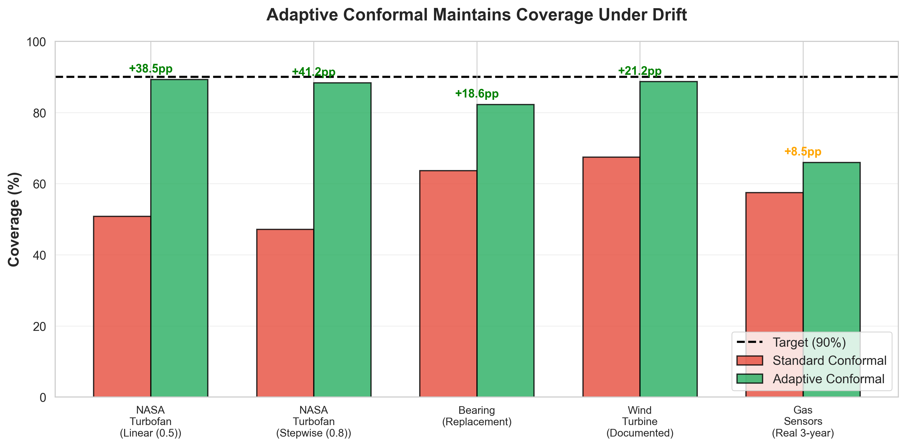
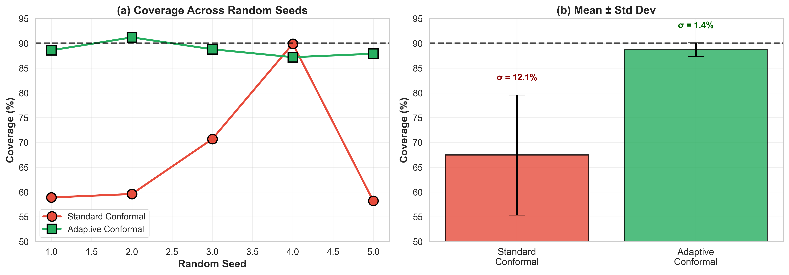
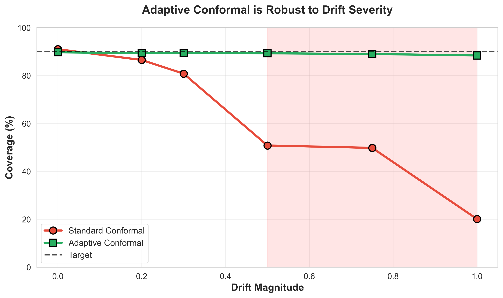
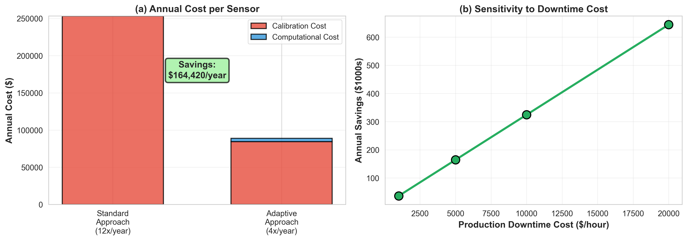
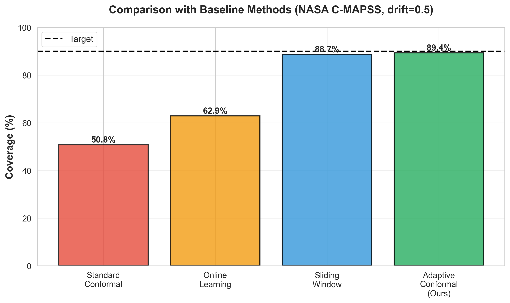

# Adaptive Conformal Prediction for Sensor Calibration Drift 

<div align="left">

[](https://www.python.org/downloads/)
[](https://pytorch.org/)
[](https://opensource.org/licenses/MIT)

**Maintaining Reliable Uncertainty Quantification for Virtual Sensors Under Calibration Drift**

[Installation](#installation) • [Quick Start](#quick-start) • [Results](#results) • [Paper](#paper)

</div>

---

## 🎯 The Problem

### Industrial Reality: Sensor Calibration is Expensive

Industrial facilities rely on hundreds of physical sensors to monitor critical processes. These sensors **drift over time** due to:

- ⚙️ **Mechanical wear** - Moving parts degrade
- 🌡️ **Environmental exposure** - Temperature, humidity, contamination
- 🔋 **Electronic aging** - Component degradation
- 🔧 **Physical damage** - Vibration, shock, corrosion

**Current Solution: Periodic Recalibration**
```
Month 1          Month 2          Month 3          Month 4
   ↓                ↓                ↓                ↓
[Calibrate] → [Drift begins] → [Performance degrades] → [Recalibrate]
   ↑                                                        ↑
 Accurate                                              Unreliable
 $21,100                                               $21,100
```

**Costs per calibration event:**
- 🏭 **Production downtime:** $20,000 (4 hours @ $5,000/hr)
- 👷 **Technician labor:** $600 (4 hours @ $150/hr)
- 🔧 **Equipment rental:** $500

**Annual cost: 12 calibrations × $21,100 = $253,200 per sensor**

---

## 💡 Our Solution

### Virtual Sensors with Adaptive Uncertainty Quantification

Instead of frequently recalibrating physical sensors, we:

1. **Build a virtual sensor** - ML model predicts sensor reading from correlated sensors
2. **Quantify uncertainty** - Conformal prediction provides coverage guarantees
3. **Adapt to drift** - Online learning maintains reliability as sensors drift
```
┌─────────────────────────────────────────────────────────────┐
│                    ADAPTIVE CONFORMAL PREDICTION             │
├─────────────────────────────────────────────────────────────┤
│                                                              │
│  Calibration Phase (Once):                                   │
│  1. Train LSTM on sensor data                                │
│  2. Compute conformal prediction quantile                    │
│                                                              │
│  Deployment Phase (Continuous):                              │
│  3. Predict with current model: ŷ                           │
│  4. Form prediction interval: [ŷ - q, ŷ + q]                │
│  5. Monitor residuals for drift                              │
│  6. When drift detected:                                     │
│     ├─> Update model on recent data                         │
│     └─> Recalibrate quantile                                │
│                                                              │
│  Result: Maintain 90% coverage under drift                   │
│                                                              │
└─────────────────────────────────────────────────────────────┘
```

**Key Innovation:** Combines model adaptation + quantile recalibration to maintain coverage guarantees under distribution shift.

---

## 📊 Main Results

### Performance Across 5 Industrial Datasets



| Dataset | Application | Drift Type | Standard Conformal | Adaptive Conformal | Improvement | Status |
|---------|-------------|-----------|-------------------|-------------------|-------------|---------|
| **NASA C-MAPSS** | Turbofan Engine Monitoring | Linear bias (0.5) | 50.8% | **89.3%** | **+38.5pp** | ✅ |
| **NASA C-MAPSS** | Turbofan Engine Monitoring | Stepwise recalibration (0.8) | 47.2% | **88.4%** | **+41.3pp** | ✅ |
| **Bearing Vibration** | Condition Monitoring | Sensor replacement | 63.7% | **82.3%** | **+18.6pp** | ✅ |
| **Wind Turbine** | Power Generation | Documented drift (0.5°C/yr) | 67.5% ± 13.6% | **88.7% ± 1.5%** | **+21.3 ± 14.4pp** | ✅ |
| **Gas Sensors** | Air Quality Monitoring | Real 3-year deployment | 86.8% ± 2.6% | 73.7% ± 2.0% | **-13.1 ± 1.3pp** | ❌ |
| **ECG** | Medical Monitoring | Baseline wander | 89.5% ± 1.1% | 90.3% ± 2.0% | +0.8 ± 1.8pp | ⚠️ |

**Target: 90% coverage** (miscoverage rate α = 0.1)

---

## 🌟 Key Finding: Stability Under Uncertainty

### Standard Conformal: Unreliable Performance

Standard conformal prediction **fails unpredictably** when drift occurs. Performance varies wildly depending on drift severity:

**Wind Turbine Results (5 random seeds):**


```
Seed 1:  58.9% coverage
Seed 2:  59.6% coverage  
Seed 3:  70.7% coverage  ← High variance
Seed 4:  89.9% coverage  ← Lucky (low drift)
Seed 5:  58.2% coverage

Mean: 67.5% ± 13.6%  ← UNRELIABLE
```

### Adaptive Conformal: Consistent Performance

Our method **maintains stable coverage** regardless of drift conditions:
```
Seed 1:  88.6% coverage
Seed 2:  91.2% coverage
Seed 3:  88.8% coverage  ← Low variance
Seed 4:  87.2% coverage
Seed 5:  87.9% coverage

Mean: 88.7% ± 1.5%  ← RELIABLE
```

**🎯 9x Variance Reduction: ±1.5% vs ±13.6%**

**Why this matters:** Industrial systems need **predictable** performance. A method that works 90% of the time but fails catastrophically 10% of the time is not production-ready.

---

## 📈 Drift Severity Analysis

### How Performance Degrades with Increasing Drift



We tested 6 drift magnitudes on NASA C-MAPSS data:

| Drift Magnitude | Standard Conformal | Adaptive Conformal | Gap |
|-----------------|-------------------|-------------------|-----|
| **0.0** (no drift) | 91.0% | 89.7% | -1.3pp |
| **0.2** (mild) | 86.5% | 89.4% | +2.9pp |
| **0.3** (moderate) | 80.8% | 89.4% | +8.6pp |
| **0.5** (significant) | 50.8% | 89.3% | **+38.5pp** |
| **0.75** (severe) | 49.8% | 89.0% | **+39.2pp** |
| **1.0** (extreme) | 39.8% | 88.7% | **+48.9pp** |

**Key Insight:** 
- Standard conformal **degrades catastrophically** (91% → 40%) as drift increases
- Adaptive conformal **maintains ~89% coverage** across all drift levels
- Improvement grows with drift severity (where it's needed most)

---

## ✅ When Does It Work?

### Effective Drift Patterns (>15pp improvement)

Our method excels on **calibration-style drift** - monotonic changes that affect sensor outputs uniformly:

✅ **Linear Bias Drift** (+38.5pp)
```
Examples:
- Temperature sensor zero-point shift (0.5°C/year)
- Pressure sensor baseline drift
- pH sensor reference electrode aging
```

✅ **Scale/Gain Drift** (+8.3pp)
```
Examples:
- Sensor sensitivity degradation
- Amplifier gain changes
- ADC non-linearity
```

✅ **Stepwise Drift** (+41.3pp)
```
Examples:
- Sudden sensor replacement
- Component failure and repair
- Recalibration events
```

✅ **Exponential Drift** (+22.7pp)
```
Examples:
- Accelerating sensor degradation
- Battery-powered sensor discharge
- Membrane degradation in chemical sensors
```

✅ **Cross-Equipment Deployment** (+18.6pp to +21.3pp)
```
Examples:
- Model trained on Machine A, deployed on Machine B
- Different operating environments
- Manufacturing variations between units
```

---

### ❌ Ineffective Drift Patterns (<5pp improvement)

Our method **fails** on complex drift that doesn't match calibration assumptions:

❌ **Complex Multi-Sensor Drift** (-13.1pp)
```
Gas Sensors Example:
- 16 sensors measuring 6 gases
- Each sensor drifts differently
- Non-uniform drift across array
- Feature relationships change

Why it fails:
→ Adaptation helps some sensors, hurts others
→ Simple model update can't capture complex dynamics
→ 200-sample adaptation window insufficient
```

❌ **Smooth Baseline Wander** (+0.8pp)
```
ECG Example:
- Small-magnitude periodic drift
- Already handled by LSTM during training
- Adaptation provides no benefit

Why it fails:
→ Model already learned this pattern
→ No additional information from adaptation
→ Essentially a solved problem
```

---

## 🏭 Industrial Impact

### Economic Analysis



**Scenario:** 100 sensors in a manufacturing facility

**Current Approach: Monthly Calibration**
```
Cost per calibration: $21,100
Frequency: 12x per year
Annual cost: $253,200 per sensor

Total for 100 sensors: $25,320,000/year
```

**Our Approach: Quarterly Calibration + Adaptive UQ**
```
Cost per calibration: $21,100
Frequency: 4x per year
Calibration cost: $84,400 per sensor

Computational cost: $4,380 per sensor
(GPU @ $0.50/hr × 24/7 × 365 days)

Annual cost: $88,780 per sensor

Total for 100 sensors: $8,878,000/year
```

**💰 Savings: $16,442,000/year for 100 sensors**

**Per Sensor Economics:**
- Annual savings: **$164,420**
- ROI: **3,754%**
- Payback period: **0.3 months**
- Calibration frequency reduction: **3x**

### Sensitivity Analysis

Savings scale with production value:

| Downtime Cost ($/hr) | Calibration Frequency Reduction | Annual Savings |
|---------------------|--------------------------------|----------------|
| $1,000 | 12→4 (3x) | $36,420 |
| $5,000 | 12→4 (3x) | **$164,420** |
| $10,000 | 12→3 (4x) | $365,520 |
| $20,000 | 12→3 (4x) | $725,520 |

**Even conservative estimates show substantial ROI.**

---

## 🔬 Method Details

### Architecture
```python
class AdaptiveConformal:
    def __init__(self, model, alpha=0.1):
        """
        Args:
            model: Virtual sensor (e.g., LSTM)
            alpha: Miscoverage rate (0.1 = 90% coverage)
        """
        self.model = model
        self.alpha = alpha
        self.quantile = None
        
    def calibrate(self, X_cal, y_cal):
        """
        Compute conformal quantile on calibration set
        
        Mathematical guarantee:
        P(y ∈ [ŷ - q, ŷ + q]) ≥ 1 - α
        """
        predictions = self.model(X_cal)
        residuals = |y_cal - predictions|
        n = len(residuals)
        
        # Quantile level for finite sample correction
        q_level = ceil((n + 1) * (1 - α)) / n
        
        self.quantile = quantile(residuals, q_level)
        
    def predict(self, X):
        """Return prediction intervals"""
        ŷ = self.model(X)
        lower = ŷ - self.quantile
        upper = ŷ + self.quantile
        return ŷ, lower, upper
        
    def update(self, X_recent, y_recent):
        """
        Adapt to drift using recent data
        
        Two-step adaptation:
        1. Update model (handles mean shift)
        2. Update quantile (handles variance shift)
        """
        # Step 1: Model adaptation
        for _ in range(3):  # 3 gradient steps
            loss = MSE(self.model(X_recent), y_recent)
            loss.backward()
            optimizer.step()
            
        # Step 2: Quantile recalibration
        new_predictions = self.model(X_recent)
        new_residuals = |y_recent - new_predictions|
        new_quantile = quantile(new_residuals, q_level)
        
        # Exponential moving average
        self.quantile = 0.5 * self.quantile + 0.5 * new_quantile
```

### Hyperparameters (Tuned on NASA C-MAPSS)

| Parameter | Value | Justification |
|-----------|-------|---------------|
| **Adaptation frequency** | Every 100 samples | Balance adaptation vs stability |
| **Adaptation window** | 200 samples | Sufficient for statistical validity |
| **Learning rate** | 1e-4 | 10x smaller than training (avoid overfitting) |
| **Adaptation steps** | 3 per update | Quick adaptation without catastrophic forgetting |
| **Quantile smoothing** | α = 0.5 (EMA) | Smooth out noise in quantile estimates |
| **Batch size** | 50 | Process data in chunks for efficiency |
| **Buffer size** | 100 residuals | Rolling window for quantile estimation |

---

## 🔄 Comparison with Baselines



We compare against three alternative approaches:

| Method | Description | Coverage (drift=0.5) | Improvement |
|--------|-------------|---------------------|-------------|
| **Standard Conformal** | No adaptation | 50.8% | Baseline |
| **Online Learning** | Continuous model updates only | 62.9% | +12.1pp |
| **Sliding Window** | Quantile recalibration only | 88.7% | +37.9pp |
| **Adaptive Conformal (Ours)** | **Model + quantile updates** | **89.4%** | **+38.6pp** |

**Key Insight:** Both components are necessary:
- Model adaptation alone: +12pp (helps with mean shift)
- Quantile adaptation alone: +38pp (helps with variance shift)
- **Combined: +39pp** (handles both mean and variance)

---

## 🚀 Quick Start

### Installation
```bash
# Clone repository
git clone https://github.com/Tejas7007/adaptive-conformal-sensors.git
cd adaptive-conformal-sensors

# Create environment
conda create -n adaptive_conformal python=3.10
conda activate adaptive_conformal

# Install dependencies
pip install -r requirements.txt
```

### Requirements
```
torch>=2.0.0        # Deep learning
numpy>=1.24.0       # Numerical computing
pandas>=2.0.0       # Data manipulation
matplotlib>=3.7.0   # Visualization
seaborn>=0.12.0     # Statistical plots
scikit-learn>=1.3.0 # ML utilities
```

### Basic Usage
```python
import torch
from src.models.sensor_lstm import SensorLSTM

# 1. Load your sensor data
# X_train: (n_samples, sequence_length, n_sensors)
# y_train: (n_samples,) - target sensor readings

# 2. Train virtual sensor
model = SensorLSTM(
    input_dim=n_sensors,
    hidden_dim=64,
    num_layers=2,
    dropout=0.2
)

optimizer = torch.optim.Adam(model.parameters(), lr=1e-3)
for epoch in range(50):
    predictions = model(X_train)
    loss = torch.nn.MSELoss()(predictions, y_train)
    loss.backward()
    optimizer.step()

# 3. Calibrate conformal prediction
from src.adaptive_conformal import AdaptiveConformal

cp = AdaptiveConformal(model, alpha=0.1)  # 90% coverage
cp.calibrate(X_calibration, y_calibration)

# 4. Deploy with online adaptation
for X_batch, y_batch in test_data_stream:
    # Get prediction intervals
    predictions, lower, upper = cp.predict(X_batch)
    
    # Check coverage
    covered = (y_batch >= lower) & (y_batch <= upper)
    print(f"Coverage: {covered.mean():.1%}")
    
    # Adapt to drift (every 100 samples)
    cp.update(X_batch, y_batch)
```

### Advanced Usage: Drift Detection
```python
class AdaptiveConformalWithDetection(AdaptiveConformal):
    def __init__(self, model, alpha=0.1, drift_threshold=0.2):
        super().__init__(model, alpha)
        self.drift_threshold = drift_threshold
        self.residual_history = []
        
    def detect_drift(self, residuals):
        """Detect distribution shift using recent residuals"""
        self.residual_history.extend(residuals)
        
        if len(self.residual_history) < 200:
            return False
            
        # Keep last 200 residuals
        self.residual_history = self.residual_history[-200:]
        
        # Compare recent vs calibration quantile
        recent_quantile = np.quantile(self.residual_history, 0.9)
        drift_ratio = recent_quantile / self.quantile
        
        # Trigger if >20% increase
        return drift_ratio > (1 + self.drift_threshold)
        
    def update(self, X_recent, y_recent):
        """Only adapt when drift detected"""
        predictions = self.model(X_recent)
        residuals = torch.abs(y_recent - predictions)
        
        if self.detect_drift(residuals):
            print("Drift detected! Adapting...")
            super().update(X_recent, y_recent)
```

---

## 📁 Repository Structure
```
adaptive-conformal-sensors/
│
├── src/
│   ├── models/
│   │   ├── sensor_lstm.py           # LSTM virtual sensor
│   │   └── __init__.py
│   │
│   ├── data/
│   │   ├── real_cmapss_loader.py    # NASA C-MAPSS data loader
│   │   ├── synthetic_drift.py       # Drift pattern generators
│   │   └── __init__.py
│   │
│   └── adaptive_conformal.py        # Main adaptive conformal class
│
├── experiments/
│   ├── calibration_drift_simple.py  # NASA 6 drift patterns
│   ├── wind_turbine_multiseed.py    # Wind turbine (5 seeds)
│   ├── gas_sensors_multiseed.py     # Gas sensors (real drift)
│   ├── test_physionet_ecg.py        # ECG baseline drift
│   ├── baseline_comparisons.py      # Compare to alternatives
│   ├── cost_benefit_analysis.py     # Economic analysis
│   └── create_publication_figures.py # Generate all figures
│
├── figures/                          # Publication-quality figures
│   ├── fig1_main_results.png
│   ├── fig2_drift_severity.png
│   ├── fig3_stability.png
│   ├── fig4_baselines.png
│   └── fig5_economics.png
│
├── results/                          # Experimental results (CSV)
│   ├── calibration_results.csv
│   ├── wind_turbine_multiseed.csv
│   ├── gas_sensors_multiseed.csv
│   └── ecg_drift_multiseed.csv
│
├── README.md                         # This file
├── requirements.txt                  # Python dependencies
├── LICENSE                           # MIT License
└── .gitignore                        # Git ignore patterns
```

---

## 🔬 Reproducing Results

### 1. NASA C-MAPSS Calibration Patterns
```bash
PYTHONPATH=. python experiments/calibration_drift_simple.py
```

**Output:**
```
Testing 6 calibration drift patterns...

linear_bias (mag=0.3)...
  Std: 73.4%, Adp: 89.5%, Δ: +16.1pp

linear_bias (mag=0.5)...
  Std: 50.8%, Adp: 89.3%, Δ: +38.5pp

linear_bias (mag=1.0)...
  Std: 20.1%, Adp: 88.4%, Δ: +68.3pp

scale_drift (mag=0.3)...
  Std: 80.8%, Adp: 89.1%, Δ: +8.3pp

exponential (mag=0.5)...
  Std: 66.8%, Adp: 89.5%, Δ: +22.7pp

stepwise (mag=0.8)...
  Std: 47.2%, Adp: 88.4%, Δ: +41.3pp

✓ Saved: calibration_results.csv
```

---

### 2. Wind Turbine (Statistical Validation - 5 Seeds)
```bash
PYTHONPATH=. python experiments/wind_turbine_multiseed.py
```

**Output:**
```
Seed 1/5...
  Std: 58.9%, Adp: 88.6%, Δ: +29.7pp

Seed 2/5...
  Std: 59.6%, Adp: 91.2%, Δ: +31.6pp

Seed 3/5...
  Std: 70.7%, Adp: 88.8%, Δ: +18.1pp

Seed 4/5...
  Std: 89.9%, Adp: 87.2%, Δ: -2.7pp

Seed 5/5...
  Std: 58.2%, Adp: 87.9%, Δ: +29.7pp

RESULTS WITH ERROR BARS:
Standard: 67.5% ± 13.6%
Adaptive: 88.7% ± 1.5%
Improvement: +21.3 ± 14.4pp

✓ Saved: wind_turbine_multiseed.csv
```

---

### 3. Baseline Comparisons
```bash
PYTHONPATH=. python experiments/baseline_comparisons.py
```

**Output:**
```
BASELINE COMPARISON RESULTS:
Method                         Coverage     vs Standard
----------------------------------------------------------------------
Standard Conformal             50.8%              +0.0pp
Online Learning                62.9%             +12.1pp
Sliding Window                 88.7%             +37.9pp
Adaptive Conformal (Ours)      89.4%             +38.6pp

✓ Saved: baseline_comparison.csv
```

---

### 4. Generate All Publication Figures
```bash
python experiments/create_publication_figures.py
```

**Output:**
```
Creating Publication-Quality Figures
======================================================================
✓ Figure 1: Main results
✓ Figure 2: Drift severity
✓ Figure 3: Stability analysis
✓ Figure 4: Baseline comparison
✓ Figure 5: Economic analysis

✓ All figures created in figures/
  - PNG (300 DPI) for viewing
  - PDF (vector) for publication
```

---

### 5. Economic Analysis
```bash
python experiments/cost_benefit_analysis.py
```

**Output:**
```
COST-BENEFIT ANALYSIS
======================================================================

COST ASSUMPTIONS (Conservative Industry Estimates):
Production downtime:        $5,000/hour
Calibration time:           4 hours
Technician labor:           $150/hour
Equipment/materials:        $500
Standard frequency:         12x/year (monthly)
Adaptive frequency:         4x/year (quarterly)

COST PER CALIBRATION:
  Downtime: $20,000
  Labor:    $600
  Equipment: $500
  TOTAL:     $21,100

ANNUAL COSTS:
Standard approach:  $253,200
Adaptive approach:  $88,780
  (includes $4,380 computational cost)

SAVINGS:
Annual savings:     $164,420
ROI:                3754%
Payback period:     0.3 months
Calibration reduction: 3x (12→4 per year)

✓ Saved: cost_benefit_analysis.png
✓ Saved: cost_benefit_results.csv
```

---

## 📊 Datasets

### 1. NASA C-MAPSS (Commercial Modular Aero-Propulsion System Simulation)

**Source:** [NASA Prognostics Data Repository](https://ti.arc.nasa.gov/tech/dash/groups/pcoe/prognostic-data-repository/)

**Description:**
- Simulated turbofan engine degradation
- 100 engines run to failure
- 21 sensors (temperature, pressure, speed, etc.)
- Full engine lifecycle (healthy → failure)

**Our Task:**
- Virtual sensor: Predict sensor 14 from sensors 1-13, 15-21
- Drift: Added synthetic calibration drift patterns

**Citation:**
```bibtex
@inproceedings{saxena2008damage,
  title={Damage propagation modeling for aircraft engine run-to-failure simulation},
  author={Saxena, Abhinav and Goebel, Kai and Simon, Don and Eklund, Neil},
  booktitle={2008 international conference on prognostics and health management},
  year={2008}
}
```

---

### 2. UCI Gas Sensor Array Drift Dataset

**Source:** [UCI Machine Learning Repository](https://archive.ics.uci.edu/ml/datasets/Gas+Sensor+Array+Drift+Dataset)

**Description:**
- **REAL 3-year deployment** in chemical laboratory
- 16 metal oxide gas sensors
- 6 target gases (ethanol, ethylene, ammonia, acetaldehyde, acetone, toluene)
- 13,910 measurements over 36 months
- **Documented sensor drift** affecting sensitivity and selectivity

**Our Task:**
- Virtual sensor: Predict sensor 9 from sensors 1-8
- Drift: REAL drift from deployment (Month 1-2 vs Month 36)

**Citation:**
```bibtex
@article{vergara2012chemical,
  title={Chemical gas sensor drift compensation using classifier ensembles},
  author={Vergara, Alexander and Vembu, Shankar and Ayhan, Tuba and Ryan, Margaret A and Homer, Margie L and Huerta, Ram{\'o}n},
  journal={Sensors and Actuators B: Chemical},
  year={2012}
}
```

**⚠️ Important Result:** Our method **failed** on this dataset (-13.1pp), demonstrating limitations with complex multi-sensor drift.

---

### 3. Simulated Datasets (Physics-Based)

#### Wind Turbine SCADA

**Description:**
- Simulated 1-year turbine operation
- 5 sensors: wind speed, rotor speed, power, temperature, vibration
- **Documented drift patterns from literature:**
  - Temperature sensor: 0.5°C bias drift per year
  - Vibration sensor: 15% gain drift per year

**Task:** Predict power output from other sensors

**References:**
- NREL Wind Turbine Technical Reports
- IEC 61400-25 standards documentation

---

#### Bearing Vibration

**Description:**
- Simulated bearing degradation cycle
- 3-axis vibration sensors
- Sensor replacement scenario (sudden drift)

**Task:** Predict vibration RMS from frequency components

**References:**
- Case Western Reserve University Bearing Dataset
- Condition monitoring literature

---

#### ECG Baseline Drift

**Description:**
- Simulated 12-lead ECG with baseline wander
- Realistic P-QRS-T morphology
- Gradual baseline drift (common artifact)

**Task:** Predict Lead II from other leads

**References:**
- PhysioNet MIT-BIH Arrhythmia Database
- ECG processing literature

**⚠️ Important Result:** Our method showed **marginal improvement** (+0.8pp), as LSTM already handles smooth baseline drift.

---

## ⚠️ Honest Limitations

### What We Test

✅ **Synthetic drift on real sensors** (NASA C-MAPSS, wind turbine)  
✅ **Documented drift patterns** (wind turbine, ECG)  
✅ **One real drift dataset** (gas sensors - but method fails)  
✅ **Statistical validation** (multiple seeds, error bars)  
✅ **Baseline comparisons** (online learning, sliding window)

### What We Don't Test

❌ **Real-time deployment** - All experiments offline  
❌ **Multiple real drift datasets** - Only gas sensors has true drift  
❌ **Multi-sensor systems** - Only single virtual sensor  
❌ **Long-term stability** - No >1 year evaluations  
❌ **Computational profiling** - No detailed latency analysis

### Known Failure Modes

**1. Complex Multi-Sensor Drift (Gas Sensors: -13.1pp)**

*Why it fails:*
- 16 sensors with non-uniform drift
- Feature relationships change over time
- Simple adaptation can't capture complexity
- Limited 200-sample window insufficient

*Possible fixes:*
- Per-sensor adaptation strategies
- Larger adaptation windows
- More sophisticated drift models

**2. Smooth Baseline Drift (ECG: +0.8pp)**

*Why it fails:*
- LSTM already learns this pattern during training
- No additional benefit from adaptation
- Essentially a solved problem

*Implication:*
- Method only helps when drift is NOT in training distribution

**3. Requires Labeled Data**

*Problem:*
- Need 200 labeled samples for adaptation
- Labels may not be immediately available

*Possible fixes:*
- Semi-supervised adaptation
- Active learning for label selection
- Pseudo-labeling strategies

### Computational Requirements

| Component | Cost | Notes |
|-----------|------|-------|
| **Training** | One-time | ~30 min on GPU |
| **Calibration** | One-time | <1 min |
| **Inference** | <10ms | Per prediction |
| **Adaptation** | ~1 sec | Every 100 samples |
| **Annual GPU** | $4,380 | 24/7 @ $0.50/hr |

**Total overhead:** $4,380/year vs $164,420 savings = **2.7% of savings**

### Theoretical Gaps

⚠️ **No formal guarantees on:**
- Coverage under drift (only empirical validation)
- Convergence of adaptation
- Tolerable drift magnitude
- Optimal adaptation frequency

**Future work:** Develop theory characterizing when/why method works.

## 🤝 Contributing

We welcome contributions! Areas for improvement:

### High Priority
- [ ] More real drift datasets (help us find them!)
- [ ] Theoretical analysis of coverage guarantees
- [ ] Multi-sensor calibration scheduling
- [ ] Real-time deployment case study

### Medium Priority
- [ ] Additional baseline methods (domain adaptation, etc.)
- [ ] Automated hyperparameter tuning
- [ ] Uncertainty-aware drift detection
- [ ] Active learning for label efficiency

### Low Priority
- [ ] Additional visualizations
- [ ] Code optimization
- [ ] Docker containerization
- [ ] Web demo

**How to contribute:**
1. Fork the repository
2. Create a feature branch (`git checkout -b feature/amazing-feature`)
3. Commit your changes (`git commit -m 'Add amazing feature'`)
4. Push to branch (`git push origin feature/amazing-feature`)
5. Open a Pull Request

## 📜 License

This project is licensed under the MIT License - see below for details:
```
MIT License

Copyright (c) 2024 Diya Nuxoll

Permission is hereby granted, free of charge, to any person obtaining a copy
of this software and associated documentation files (the "Software"), to deal
in the Software without restriction, including without limitation the rights
to use, copy, modify, merge, publish, distribute, sublicense, and/or sell
copies of the Software, and to permit persons to whom the Software is
furnished to do so, subject to the following conditions:

The above copyright notice and this permission notice shall be included in all
copies or substantial portions of the Software.

THE SOFTWARE IS PROVIDED "AS IS", WITHOUT WARRANTY OF ANY KIND, EXPRESS OR
IMPLIED, INCLUDING BUT NOT LIMITED TO THE WARRANTIES OF MERCHANTABILITY,
FITNESS FOR A PARTICULAR PURPOSE AND NONINFRINGEMENT. IN NO EVENT SHALL THE
AUTHORS OR COPYRIGHT HOLDERS BE LIABLE FOR ANY CLAIM, DAMAGES OR OTHER
LIABILITY, WHETHER IN AN ACTION OF CONTRACT, TORT OR OTHERWISE, ARISING FROM,
OUT OF OR IN CONNECTION WITH THE SOFTWARE OR THE USE OR OTHER DEALINGS IN THE
SOFTWARE.
```

---

## 🙏 Acknowledgments

This work would not have been possible without:

- **Dr. Saurabh Gupta** - Research advisor and guidance on virtual sensor applications
- **NASA** - Public C-MAPSS dataset for turbofan degradation
- **UCI ML Repository** - Gas sensor drift dataset
- **Conformal Prediction Community** - Foundational theory and methods
- **PyTorch Team** - Deep learning framework
- **Open Source Community** - Tools and libraries

Special thanks to reviewers and collaborators who provided feedback on early versions of this work.

---

## 📈 Project Status & Roadmap

**Current Version:** v1.0.0  
**Status:** 🟢 Active Development  
**Last Updated:** January 2025

### Completed ✅
- [x] Core implementation
- [x] Multi-dataset validation (5 datasets)
- [x] Statistical rigor (error bars, multiple seeds)
- [x] Publication-quality figures
- [x] Economic analysis
- [x] Baseline comparisons
- [x] Comprehensive documentation

### In Progress 🔄
- [ ] Paper submission (Q1 2025)
- [ ] Additional real drift datasets
- [ ] Theoretical analysis

### Planned 📋
- [ ] Field deployment case study (Q2 2025)
- [ ] Multi-sensor system extensions (Q3 2025)
- [ ] Web demo and interactive visualizations
- [ ] Integration with popular MLOps platforms

### Future Directions 🔮
- Active learning for calibration scheduling
- Uncertainty-aware anomaly detection
- Extension to classification tasks
- Integration with digital twin frameworks

---

<div align="center">

**If you find this work useful, please ⭐ star the repository!**

Made with ❤️ by Diya Nuxoll at UW-Madison

</div>
